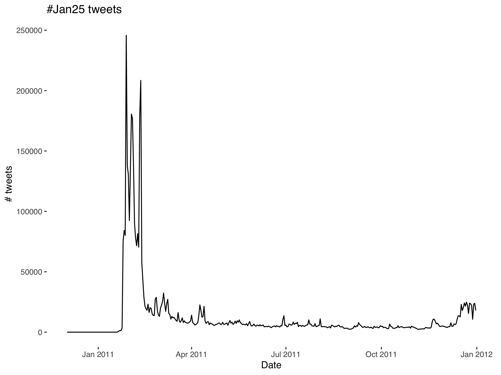
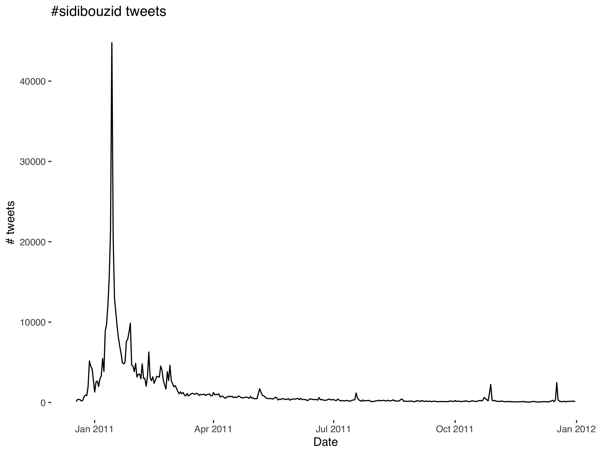

# arbsprngtweets

Repo containing Tweet IDs and code relevant to the Arab Spring uprisings. These were collected with the new Academic Research Product Track API endpoint. The relevant lists of tweet IDs are "jan25IDs.txt" for Egypt and "sidibouzidIDs.txt" for Tunisia.

Details of how many tweets and accounts these contain below:

| Hashtag      | N. tweets | N. accounts |
| ----------- | ----------- | ----------- |
| #Jan25     | 4,917,518    | 277,657 |
| #sidibouzid | 514,344 |  34,452 |

While relatively small by today's standards, this represents an increase on existing datasets for these hashtags, e.g. [here](http://dfreelon.org/2012/02/11/arab-spring-twitter-data-now-available-sort-of/) and [here](https://necsus-ejms.org/twitter-as-a-multilingual-space-the-articulation-of-the-tunisian-revolution-through-sidibouzid-by-thomas-poell-and-kaouthar-darmoni/).

NOTE: The data were collected end of February 2021. These data therefore do **not** capture tweets that were subsequently deleted due either to individual tweet deletion or account deletion. As a result, these tweets will be absent accounts and tweets that, for whatever reason, were deleted since the 2010-12 date range of observation window. 

These can be "rehydrated" (i.e., harvested with accompanying tweet-level information) using the DocTheNow "Hydrator" tool [here](https://github.com/DocNow/hydrator) or with a couple of lines of R or Python code.

For harvesting the tweets programmaticaly, you'll need to get authorization tokens to query the Twitter API. To do so in R, see [here](https://github.com/ropensci/rtweet); in Python see [here](https://github.com/DocNow/twarc).


## R:

```
library(rtweet)
options(scipen = 999)
IDs <- read.table("sidibouzidIDS.txt")
IDs <- IDs$V1

lookup_statuses(statuses, parse = TRUE, token = NULL)
```

## Python:

`cd` to directory containing the *IDs.txt files and twarc install, then:

```
twarc hydrate ids.txt > tweets.jsonl
```

## Egypt:



## Tunisia:

